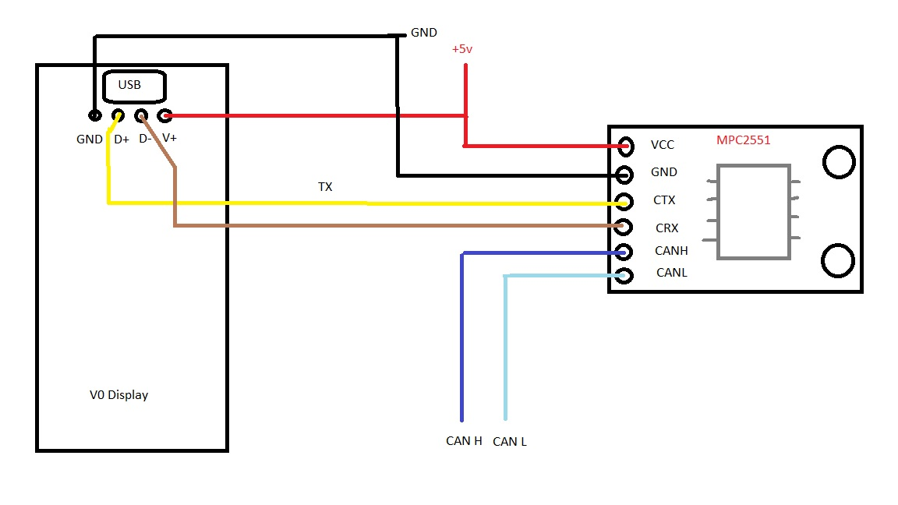

# Voron V0 Display on CANBUS


Wiring and config to run the Voron V0 display over CAN

## Setup Steps

### Compile Toolboard Firmware
- ssh to your pi console
- CD to the klipper directory
```
cd klipper
```
- Run MAKE Clean
```
make clean
```
- open menuconfig
```
make menuconfig
```
- Set the following options for CANBUS connection     


- Set the DFU boot jumper on the V0 display and connect to the Pi by USB

- Run lsusb from the command prompt. Make sure you see a device labeled STM32 in DFU mode listed
```
lsusb
```

  

- Run dfu-util --list from the command prompt
```
dfu-util --list
```
  note the text inside the [xxxx:yyyy]

- Exit and Save      

- Run make clean to clean up the make environment.
```
make clean
```

- Run make flash FLASH_DEVICE=xxxx:yyyy (using xxxx:yyyy from above)
```
make flash FLASH_DEVICE=xxxx:yyyy
```
- Remove the DFU boot jumper.

- Remove the USB cable, power off system and set up the CAN wiring. 

## Wiring Diagram

  Note: The MCP2551 does not have 120 ohm resistors. If this is the only device on your CANBUS you will need to wire a 120 ohm resistor between CANH and CANL at the MCP2551 connector.  You CANBUS should measure 60 ohms between CAN H and CAN L with all the devices connected. ( measure while powered off) 

      


## Links  

  [MCP2551 board](https://www.aliexpress.com/item/2255800362518857.html?spm=a2g0o.order_list.0.0.21ef1802WJAiGd)
  
  [Voron Hardware V0 Display](https://github.com/VoronDesign/Voron-Hardware/tree/master/V0_Display)
  
 


